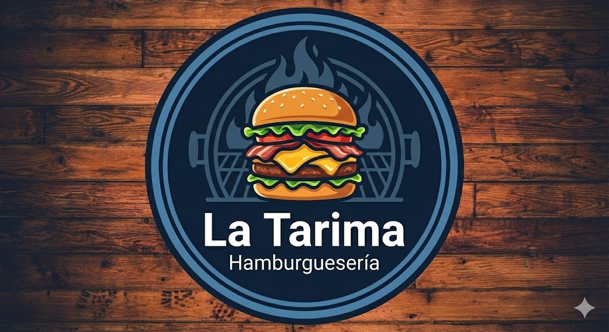
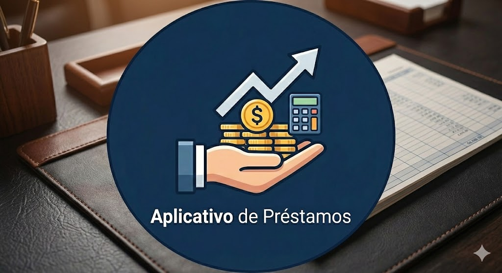

  
  <h1>¡Hola! Soy Jhon Patrick Cali 👋</h1>
  
Estudiante de Ingeniería de Sistemas | Desarrollador Full-Stack

---

## 👤 Sobre Mí

- 🎓 **Educación** | Estudiante de Ingeniería de Sistemas (7mo ciclo) enfocado en la arquitectura de software escalable.
- 🚀 **Foco Principal** | Desarrollo Full-Stack moderno construyendo aplicaciones B2B en tiempo real, desde la pasarela del cliente hasta el panel administrativo.
- 🛠️ **Habilidades** | Sincronización de bases de datos en vivo (WebSockets), diseño de algoritmos de disponibilidad dinámica, automatización de procesos y arquitecturas cliente-servidor.

---

## 🛠️ Tecnologías y Herramientas

### Frontend & Lenguajes

### Backend, Base de Datos & Entornos

---

## 🚀 Proyecto Destacado en Producción

<table align="center">
  <tr>
    <td align="center" width="100%">
      <a href="https://www.markusbarberia.com" target="_blank">
         
      </a>
      <h3>💈 Sistema de Reservas & Panel Multinivel - Markus Barbería</h3>
      

        Desarrollo de un sistema completo (Frontend y Back-office) operando en tiempo real para una cadena de 3 sedes.  
        <b>🔹 Stack:</b> Next.js, TypeScript, Tailwind, Supabase (Realtime & RLS). 
        <b>🔹 Panel Administrativo:</b> Gestión de citas, facturación y manifiesto con seguridad Middleware. 
        <b>🔹 Motor Dinámico:</b> Algoritmo de disponibilidad que cruza duraciones de múltiples servicios con la base de datos para evitar colisiones de horarios al instante.
      

      

        
        &nbsp;&nbsp;
        
      

    </td>
  </tr>
</table>

---

## 📁 Otros Proyectos

<table align="center">
  <tr>
    <td align="center" width="50%">
      <a href="https://github.com/jhonPatrick1/Sistema-LaTarima">
         
        <b>La Tarima - Gestión de Hamburguesería</b>
      </a>
      
Sistema web (PHP/MySQL) con facturación en PDF.

    </td>
    <td align="center" width="50%">
      <a href="https://github.com/jhonPatrick1/Calculadora-de-Prestamos">
         
        <b>Aplicativo de Préstamos</b>
      </a>
      
Cálculo de cuotas mediante el <b>Método Alemán</b>.

    </td>
  </tr>
</table>

---
  
## 📫 ¡Conectemos!

